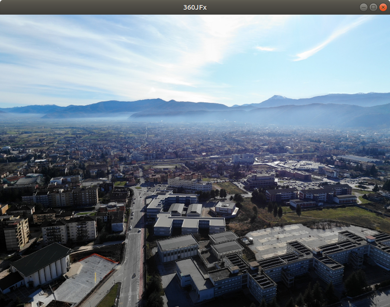

# 360JFx_p

### A tool to visualize spherical panoramas in equirectangular format

Spherical panorama pictures generated with drones, 360 cameras or just stitching single pictures together are often saved in equirectangular format.
With this tool you can visualize a spherical panorama in equirectangular format just dragging & dropping the file in the window.

